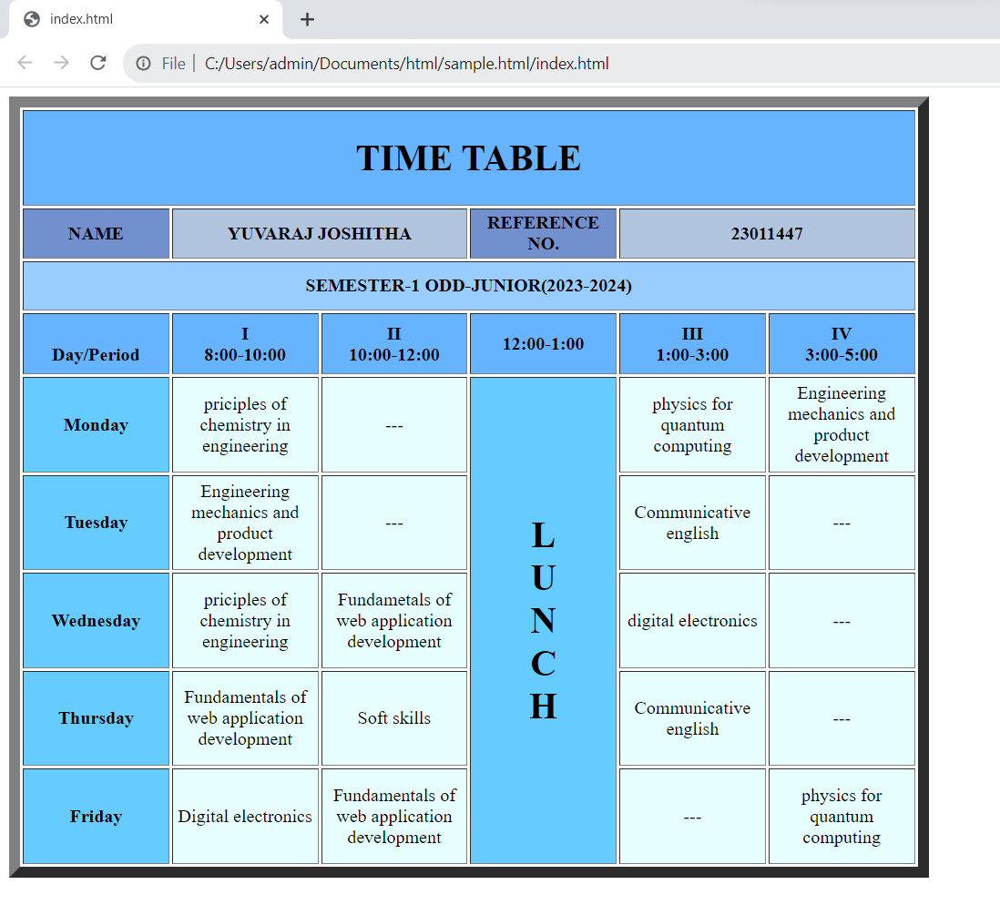

# Ex-04-Timetable

Name : Yuvaraj joshitha

Reference No :23011447

Department: AIML

## AIM
To Write a html webpage page to display your timetable.

# ALGORITHM
### STEP 1
create a simple table using table tag
### STEP 2
Add header row using th tag
### STEP 3
Add your timetable
### STEP 4
Execute the program


# CODE
```
<!DOCTYPE html>
<html>
    <head></head>
<body>

    <table border="10" cellspacing="3" align="left"  >
        
        <tr bgcolor="#66b3ff">
            <th align= "center"  colspan="6" height="50" width="100"><h1>TIME TABLE</h1></th>
        </tr>
        <tr bgcolor="#728FCE">
            <th align= "center"  colspan="1"  height="40" width="80"><b>NAME</b></th>
            <th align= "center"  colspan="2"  bgcolor="LightSteelBlue" height="40" width="80"><b>YUVARAJ JOSHITHA</b></th>
            <th align= "center"  colspan="1"  height="40" width="100"><b>REFERENCE NO.</b></th>
            <th align= "center"  colspan="2"  bgcolor="LightSteelBlue" height="40" width="80"><b>23011447</b></th>
        </tr>
        <tr bgcolor="#99ccff">
            <th align= "center"  colspan="6" height="40" width="50"> <b>SEMESTER-1 ODD-JUNIOR(2023-2024)</b></th>
        </tr>
       
        
        <tr bgcolor="#66b3ff">
            
            <td align="center"  height="50"
                width="125"><br>
                <b>Day/Period</b></br>
            </td>
            <td align="center" height="50"
                width="125">
                <b>I<br>8:00-10:00</b>
            </td>
            <td align="center" height="50"
                width="125">
                <b>II<br>10:00-12:00</b>
            </td>
            <td align="center" height="50"
                width="125">
                <b>12:00-1:00</b>
            </td>
            <td align="center" height="50"
                width="125">
                <b>III<br>1:00-3:00</b>
            </td>
            <td align="center" height="50"
                width="125">
                <b>IV<br>3:00-5:00</b>
            </td>
        </tr>
        <tr bgcolor="#66ccff">
            <td align="center" height="80">
                <b>Monday</b></td>
            <td align="center" bgcolor="#e7feff "height="50">priciples of chemistry in engineering</td>
            <td align="center" bgcolor="#e7feff " height="50">---</td>
            <td rowspan="5" align="center" height="50">
                <h1>L<br>U<br>N<br>C<br>H</h1>
            </td>
            <td bgcolor="#e7feff " align="center"height="50">physics for quantum computing</td>
            <td align="center" bgcolor="#e7feff " height="50">Engineering mechanics and product development</td>
        </tr>
        <tr bgcolor="#66ccff">
            <td align="center"  height="80">
                <b>Tuesday</b>
            </td>
            <td  bgcolor="#e7feff "align="center"height="50">Engineering mechanics and product development</td>
            <td align="center" bgcolor="#e7feff "height="50">---</td>
            <td align="center" bgcolor="#e7feff "height="50">Communicative english</td>
            <td align="center" bgcolor="#e7feff " height="50">---</td>
            
        </tr>
        <tr bgcolor="#66ccff">
            <td align="center" height="80">
                <b>Wednesday</b>
            </td>
            <td align="center" bgcolor="#e7feff " height="50">priciples of chemistry in engineering</td>
            <td align="center" bgcolor="#e7feff "height="50">Fundametals of web application development</td>
            <td align="center" bgcolor="#e7feff " height="50">digital electronics</td>
            <td align="center" bgcolor="#e7feff " height="50">---</td>
        </tr>
        <tr bgcolor="#66ccff">
            <td align="center" height="80">
                <b>Thursday</b>
            </td>
            <td align="center" bgcolor="#e7feff" height="50">Fundamentals of web application development</td>
            <td align="center"  bgcolor="#e7feff "height="50">Soft skills</td>
            <td align="center" bgcolor="#e7feff "height="50">Communicative english</td>
            <td  align="center" bgcolor="#e7feff " height="50">---</td>
        </tr>
        <tr bgcolor="#66ccff">
            <td align="center"  height="80">
                <b>Friday</b>
            </td>
            <td align="center" bgcolor="#e7feff "height="50">Digital electronics</td>
            <td align="center" bgcolor="#e7feff "height="50">Fundamentals of web application development</td>
            <td align="center" bgcolor="#e7feff " height="50">---</td>
            <td align="center" bgcolor="#e7feff " height="50">physics for quantum computing</td>
        </tr>
    </table>
</body>
</html>
```

# OUPUT

